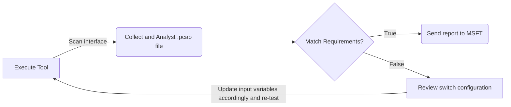
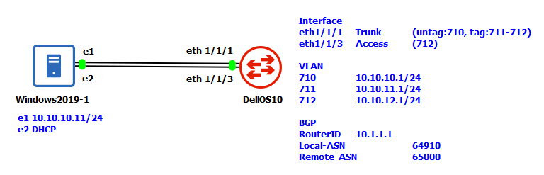

#  Azure Stack HCI - Network Switch Device Validation

## Note 
Please use `release_windows` branch as main branch at this moment as this branch is still in progress.

## Background

This tool is intended to be used as a device testing tool for Azure Stack HCI. For more information on the requirements, please see: [Physical network requirements for Azure Stack HCI](https://docs.microsoft.com/en-us/azure-stack/hci/concepts/physical-network-requirements)

## How to use the tool

- Prepare a host which has at least two NICs which connect to switch device under test (DUT)
- Download from [Release page](https://github.com/microsoft/AzureStackHCI-Network-Switch-Validation/releases) and store them in a folder on the host
- If necessary, edit the ini file to represent your environment
- Run the SwitchValidationTool.exe
- Review the report. (Result report will be PDF, and check sample reports under `sampleResult` folder.)

The validation tool will collect network traffic and decode packages to validate protocol value required. 

### Logic Diagram


### Platform Support

#### Linux

Tested: Ubuntu Linux 20.04
Untested: Other Linux versions

### Preparation

The following shows the reference lab setup that can be modified accordingly based on needs.


#### Configure Network Switch

The following image demonstrates a sample switch configuration based on [DellOS10](./switchReferenceConfig/Dell_OS10.conf)

##### Notice:

- Spanning Tree mode must be PVST for tool to capture all VLANID.
- LLDP must be enabled.


### Execution and Troubleshooting

**Tool must be run with Administrator/Sudo privilege**

```
C:\>switchValidationTool.exe -h
Usage of switchValidationTool.exe:
  -iniFilePath string
        Please input INI file path. (default "./input.ini")

C:\>switchValidationTool.exe
2022/05/07 10:49:48 main.go:90: ./input.ini found.
{10.10.10.11/24 [710 711 712] 9214 8 0:48,1:0,2:0,3:50,4:0,5:2,6:0,7:0 8 0:0,1:0,2:0,3:1,4:0,5:0,6:0,7:0}
2022/05/07 10:49:48 main.go:121: Found matched host interface by IP: 10.10.10.11/24 - \Device\NPF_{96CB802D-E41B-477E-BC46-B37A001AD1EF}
Processing, please wait up to ~2 mins, otherwise please double check if the interface has live traffic.
Collecting Network Packages: [1 / 300 (Max)]
Collecting Network Packages: [2 / 300 (Max)]
Collecting Network Packages: [3 / 300 (Max)]
...
Collecting Network Packages: [261 / 300 (Max)]
2022/05/07 10:51:21 packetCollect.go:61: Reach preset max session time 1m30s, close live collection.
2022/05/07 10:51:21 main.go:90: ./result.pcap founded.
### Validation Summary Result ###

        BGP - PASS

        DHCPRelay - PASS

        LLDP - FAIL
                - No LLDP IEEE 802.1 VLAN Name (Subtype 3) Founded
                - Incorrect Maximum Frame Size - Input:9214, Found: 9216
                - Incorrect ETS Class Bandwidth Configured:
                Input:0:48,1:0,2:0,3:50,4:0,5:2,6:0,7:0
                Found: 0:46,1:1,2:1,3:48,4:1,5:1,6:1,7:1

        VLAN - PASS

        Result PDF File Generated
```

- To avoid endless running, the tool has preset maximum timeout condition, and will stop collecting whenever hit first.

  - 90 seconds
  - 300 network packets

- Please double check the interface connection and configuration if no network packet being collected.

## What will be validated
### Current Version

#### BGP

- TCP destination port 179

#### DHCP Relay

- UDP destination port 67

#### LLDP

- Subtype 1 (Native VLAN)
- Subtype 3 (All VLANs)
- Subtype 4 (MTU)
- Subtype 9 (ETS Configuration)
- Subtype B (PFC)
- Chassis ID Type: MAC Address

#### VLAN

- VLAN IDs allowed in the trunk

### Todo List
- Advance MTU: Cross hosts L2 port testing.
- Advance DCB: Cross hosts traffic bandwidth testing.

## Common Questions

### Error "Could't load wpcap.dll" when run the tool.

The tool is written by Go and using [gopacket](https://pkg.go.dev/github.com/google/gopacket/pcap) which requires [libpcap](https://github.com/google/gopacket/blob/master/pcap/pcap_windows.go) pre-installed. The tool will automatically install libpcap based on OS, so Internet is required for the host.

For Linux: Run `sudo apt install libpcap-dev`

##### Note: libpcap only need to be installed once, and can be uninstalled after the validation.

### What should do if met errors while running the tool?

Please check [Troubleshooting_Manual](./Troubleshooting_Manual.md) to find matched error. If error not existing, please file issues to the repository.

### Host not able to run the tool or `alert security scan required`

Current version is still beta version, so hasn't signed, so that cause the alert, but it will be passed if running with `administrator` level.

# Contributing

This project welcomes contributions and suggestions.  Most contributions require you to agree to a
Contributor License Agreement (CLA) declaring that you have the right to, and actually do, grant us
the rights to use your contribution. For details, visit https://cla.microsoft.com.

When you submit a pull request, a CLA-bot will automatically determine whether you need to provide
a CLA and decorate the PR appropriately (e.g., label, comment). Simply follow the instructions
provided by the bot. You will only need to do this once across all repos using our CLA.

This project has adopted the [Microsoft Open Source Code of Conduct](https://opensource.microsoft.com/codeofconduct/).
For more information see the [Code of Conduct FAQ](https://opensource.microsoft.com/codeofconduct/faq/) or
contact [opencode@microsoft.com](mailto:opencode@microsoft.com) with any additional questions or comments.
