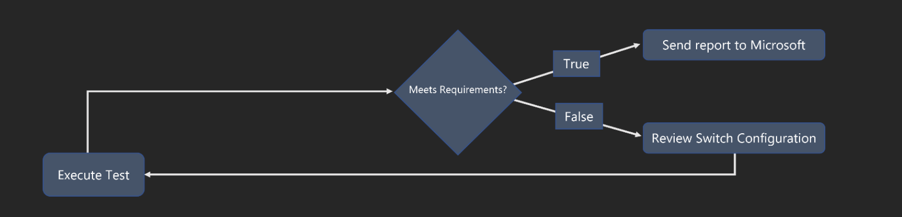

#  Azure Stack HCI - Network Switch Device Validation

## Background

This tool is intended to be used as a device testing tool for Azure Stack HCI. For more information on the requirements, please see: [Physical network requirements for Azure Stack HCI](https://learn.microsoft.com/en-us/azure-stack/hci/concepts/physical-network-requirements?tabs=20-21H2%2C20-21H2reqs)

## How to use the tool

- Prepare a host which has at least two NICs which connect to switch device under test (DUT)
- Download `SwitchValidationTool.zip` from [Release page](https://github.com/microsoft/AzureStackHCI-Network-Switch-Validation/releases) and store them in a folder on the host
- The tool will scan all active interfaces on the host but only generate report of `LLDP` enabled interface.
- Review the [sample report](./switchReferenceConfig) which will be PDF/JSON/YAML files.
- The validation tool will collect network traffic and decode packages to validate protocol value required. 
- Upload results under under the "Issues" tab in GitHub

### Logic Diagram


A[Execute Tool] -->|Scan interface| B(Collect and Analyst .pcap file)
B --> C{Match Requirements?}
C --> |True|D(Send report to MSFT)
C --> |False|E[Review switch configuration]
E --> |Update input variables accordingly and re-test | A
```

### Platform Support

#### Windows

Tested: Windows 11, Windows Server 2019
Untested: Other Windows versions

#### Linux

Tested: Ubuntu Linux 20.04
Untested: Other Linux versions

## Preparation

The following shows the reference lab setup that can be modified accordingly based on needs.


#### Configure Network Switch

Please check the [sample switch configuration](./switchReferenceConfig) for reference.

##### Notice:

- LLDP must be enabled.

## Get Started

### Run On Windows

#### Download Tool Files
Windows folder includes
- SwitchValidation.psm1
- SwitchValidationTool.exe

#### Get Test Host Interface Index
The index of interface which connected to switch is required for Windows OS users, so please check and validate the `ifIndex` number for your own test host which will be used for the tool execution.

```powershell
PS C:\> Get-NetAdapter
Name                      InterfaceDescription            ifIndex Status                   
----                      --------------------            ------- ------                   
Wi-Fi                     Intel(R) Wi-Fi 6                16       Up               
Ethernet 1                Ethernet Adapter                2        Up    
```
Please check [Get-NetAdapter](https://docs.microsoft.com/en-us/powershell/module/netadapter/get-netadapter?view=windowsserver2022-ps) for more detail.

### Execution and Troubleshooting

**Tool must be run with Administrator/Sudo privilege**

```powershell
PS C:\> Import-Module .\SwitchValidation.psm1 -Force
PS C:\> Get-Command -m SwitchValidation
CommandType     Name                                               Version    Source
-----------     ----                                               -------    ------
Function        Invoke-SwitchValidation                            0.0        SwitchValidation
PS C:\> Get-Help Invoke-SwitchValidation
NAME
    Invoke-SwitchValidation
SYNOPSIS
    Execute Invoke-SwitchValidation on Windows
SYNTAX
    Invoke-SwitchValidation [-ifIndex] <UInt32> [-nativeVlanID] <UInt32> [-allVlanIDs] <String> [[-mtu] <UInt32>]
    [[-etsMaxClass] <UInt32>] [[-etsBWbyPG] <String>] [[-pfcMaxClass] <UInt32>] [[-pfcPriorityEnabled] <String>]
    [<CommonParameters>]

C:\> Invoke-SwitchValidation
Supply values for the following parameters:
ifIndex: [Your Interface ifIndex Number], example: 12
nativeVlanID: [Switch Port Native VLAN ID], example: 710
allVlanIDs: [Switch Trunk Allowed VLAN IDs], example: 710,711,712
interface Wi-Fi is selected
-interfaceAlias "Wi-Fi" -interfaceGUID "{A91A8E1F-C8B3-4D96-A403-78B9E758EA38}"
PS C:\switchValidationTool> 2022/06/03 15:29:56 Collecting Network Packages from Interface Ethernet1: [1 / 300 (Max)]
2022/06/03 15:29:56 Collecting Network Packages from Interface Ethernet1: [2 / 300 (Max)]
2022/06/03 15:29:56 Collecting Network Packages from Interface Ethernet1: [3 / 300 (Max)]
...
2022/06/03 15:29:56 Collecting Network Packages from Interface Ethernet1: [300 / 300 (Max)]
---------------------
Report Files have been generated.
```

### Run On Linux

#### Download Tool Files
Linux folder includes
- input.ini
- SwitchValidationTool

#### Update variables in ini file
Update switch configured value in ini file, so the tool can parse and compare with what actually detect based on network packages. 
```ini
# ini format
[host]
# ifconfig intf name
interfaceName="eth0"
# Switch Information
# Switch vlan allowed via Trunk
[vlan]
nativeVlanID=1
allVlanIDs=1,710,711,712

# Switch interface configured MTU
[mtu]
mtuSize = 9214

# Optional input if different from default below
# All classes and stay in order
; [ets]
; ETSMaxClass=8
; ETSBWbyPG=0:48,1:0,2:0,3:50,4:0,5:2,6:0,7:0

; [pfc]
; PFCMaxClass=8
; PFCPriorityEnabled=0:0,1:0,2:0,3:1,4:0,5:0,6:0,7:0  
```
Please check [ini file](https://en.wikipedia.org/wiki/INI_file) for more detail.

### Execution and Troubleshooting

**Tool must be run with Administrator/Sudo privilege**

```shell
/src (release ✗) $ ./SwitchValidationTool -h
Usage of ./SwitchValidationTool:
  -iniFilePath string
        Please input INI file path. (default "./input.ini")

/src (release ✗) $ sudo ./SwitchValidationTool 
2023/02/22 19:41:52 ./input.ini founded.
2023/02/22 19:41:53 Collecting Network Packages from Interface : [1 / 300 (Max)]
2023/02/22 19:41:53 Collecting Network Packages from Interface : [2 / 300 (Max)]
2023/02/22 19:41:53 Collecting Network Packages from Interface : [3 / 300 (Max)]
2023/02/22 19:41:53 Collecting Network Packages from Interface : [4 / 300 (Max)]
...
2023/02/22 19:41:56 Collecting Network Packages from Interface : [300 / 300 (Max)]
2023/02/22 19:41:56 ./eth0.pcap founded.
---------------------
Report Files have been generated.
```

### Notes

- To avoid endless running, the tool has preset maximum timeout condition, and will stop collecting whenever hit first.

  - 90 seconds
  - 300 network packets

- Please double check the interface connection and configuration if no network packet being collected.

### What should I do after finishing the validation?

After the tool execution successfully, there will be `five` files:
- PDF File
- JSON File
- YAML File
- Log File
- PACP file

Please group them, navigate to "Issues" and submit "Tool upload result" for the Microsoft team to review.

## Common Questions

### Error "Could't load wpcap.dll" when run the tool.

The tool is written by Go and using [gopacket](https://pkg.go.dev/github.com/google/gopacket/pcap) which requires [libpcap](https://github.com/google/gopacket/blob/master/pcap/pcap_windows.go) pre-installed. The tool will automatically install libpcap based on OS, so Internet is required for the host.

For Linux: Run `sudo apt install libpcap-dev`

For Windows, here are options:
- Option 1: Install [Npcap](https://npcap.com/), which includes libpcap.
- Option 2: Install [Wireshark](https://www.wireshark.org/), which includes Npcap.

##### Note: libpcap only need to be installed once, and can be uninstalled after the validation.

### What should do if met errors while running the tool?

Please check [Troubleshooting_Manual](./Troubleshooting_Manual.md) to find matched error. If error not existing, please file issues to the repository.

### Host not able to run the tool or `alert security scan required`

Current version is still beta version, so hasn't signed, so that cause the alert, but it will be passed if running with `administrator` level.

# Contributing

This project welcomes contributions and suggestions.  Most contributions require you to agree to a
Contributor License Agreement (CLA) declaring that you have the right to, and actually do, grant us
the rights to use your contribution. For details, visit https://cla.microsoft.com.

When you submit a pull request, a CLA-bot will automatically determine whether you need to provide
a CLA and decorate the PR appropriately (e.g., label, comment). Simply follow the instructions
provided by the bot. You will only need to do this once across all repos using our CLA.

This project has adopted the [Microsoft Open Source Code of Conduct](https://opensource.microsoft.com/codeofconduct/).
For more information see the [Code of Conduct FAQ](https://opensource.microsoft.com/codeofconduct/faq/) or
contact [opencode@microsoft.com](mailto:opencode@microsoft.com) with any additional questions or comments.
