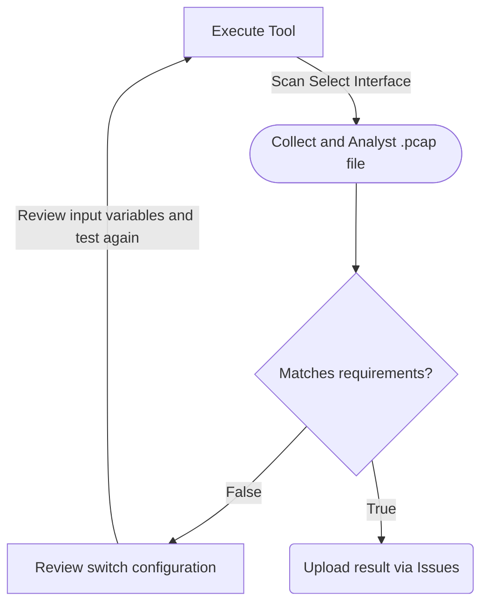
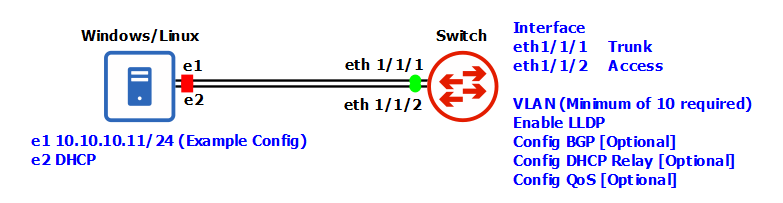

#  Azure Stack HCI - Network Switch Device Validation

## Background

This tool is intended to be used as a device testing tool for Azure Stack HCI. For more information on the requirements, please see: [Physical network requirements for Azure Stack HCI](https://learn.microsoft.com/en-us/azure-stack/hci/concepts/physical-network-requirements?tabs=20-21H2%2C20-21H2reqs)

## How to use the tool

- Prepare a host which has at least two NICs which connect to switch device under test (DUT)
- Download `SwitchValidationTool.zip` from [Release page](https://github.com/microsoft/AzureStackHCI-Network-Switch-Validation/releases) and store them in a folder on the host
- The tool will scan all active interfaces on the host but only generate report of `LLDP` enabled interface.
- Review the [sample test data](./samples/) to have better understand the input and output.
- The validation tool will collect network traffic and decode packages to validate protocol value required. 
- Upload results under the "Issues" tab in GitHub

### Logic Diagram


### Platform Support

#### Windows

Tested: Windows 11, Windows Server 2019
Untested: Other Windows versions

#### Linux

Tested: Ubuntu Linux 20.04
Untested: Other Linux versions

## Preparation

The following shows the reference lab setup that can be modified accordingly based on needs. The tool can work with virtual interfaces but prefer physical interfaces for testing if possible, which close to the real production senario.



#### Configure Network Switch

Please check the [sample switch configuration](./switchReferenceConfig) for reference.

##### Notice:

- LLDP must be enabled.
- A minimum of 10 VLANs must be configured.

## Get Started

### Run On Windows

#### Download Tool Files
Windows folder includes
- SwitchValidationTool.exe

#### Get Test Host Interface Index
The index of interface which connected to switch is required for Windows OS users, so please check and validate the `ifIndex` number for your own test host which will be used for the tool execution.

```powershell
PS C:\> Get-NetAdapter
Name                      InterfaceDescription            ifIndex Status                   
----                      --------------------            ------- ------                               
Ethernet 1                Ethernet Adapter                10        Up    
```
Please check [Get-NetAdapter](https://docs.microsoft.com/en-us/powershell/module/netadapter/get-netadapter?view=windowsserver2022-ps) for more detail.

### Execution and Troubleshooting

**Tool must be run with Administrator/Sudo privilege**

```powershell
PS C:\SwitchValidationTool\windows> .\SwitchValidationTool.exe  -h
Usage of C:\SwitchValidationTool\windows\SwitchValidationTool.exe:
  -InterfaceIndex int
        [Windows Only - Get-NetAdapter] index of interface connects with network device to be validated (default 15)
  -InterfaceName string
        [Linux Only - ifconfig] name of interface connects with network device to be validated (default "eth0")
  -allVlanIDs string
        vlan list string separate with comma. Minimum 10 vlans required. (default "710,711,712,713,714,715,716,717,718,719,720")
  -etsBWbyPG string
        bandwidth for PGID in ETS configuration (default "0:48,1:0,2:0,3:50,4:0,5:2,6:0,7:0")
  -etsMaxClass int
        maximum number of traffic classes in ETS configuration (default 8)
  -mtu int
        mtu value configured on the switch interface (default 9214)
  -nativeVlanID int
        native vlan id (default 710)
  -pfcMaxClass int
        maximum PFC enabled traffic classes in PFC configuration (default 8)
  -pfcPriorityEnabled string
        PFC for priority in PFC configuration (default "0:0,1:0,2:0,3:1,4:0,5:0,6:0,7:0")

PS C:\SwitchValidationTool\windows> .\SwitchValidationTool.exe  -InterfaceIndex 10
2023/05/18 15:31:46 ## Interface Name Ethernet 1 is selected, start collecting packages[Maximum 90s or 300 packages]: ##
2023/05/18 15:31:46
2023/05/18 15:31:47 Collecting Network Packages from Interface Ethernet 1: [1 / 300 (Max)]
2023/05/18 15:31:47 Collecting Network Packages from Interface Ethernet 1: [2 / 300 (Max)]
2023/05/18 15:31:47 Collecting Network Packages from Interface Ethernet 1: [3 / 300 (Max)]
...
2023/05/18 15:31:51 Collecting Network Packages from Interface Ethernet 1: [300 / 300 (Max)]
2023/05/18 15:31:51 ./Ethernet 1.pcap founded.
---------------------
Report Files have been generated.
```

### Run On Linux

#### Download Tool Files
Linux folder includes
- SwitchValidationTool

### Execution and Troubleshooting

**Tool must be run with Administrator/Sudo privilege**

```shell
/SwitchValidationTool/linux $ ./SwitchValidationTool -h
Usage of ./SwitchValidationTool:
  -InterfaceIndex int
        [Windows Only - Get-NetAdapter] index of interface connects with network device to be validated (default 15)
  -InterfaceName string
        [Linux Only - ifconfig] name of interface connects with network device to be validated (default "eth0")
  -allVlanIDs string
        vlan list string separate with comma. Minimum 10 vlans required. (default "710,711,712,713,714,715,716,717,718,719,720")
  -etsBWbyPG string
        bandwidth for PGID in ETS configuration (default "0:48,1:0,2:0,3:50,4:0,5:2,6:0,7:0")
  -etsMaxClass int
        maximum number of traffic classes in ETS configuration (default 8)
  -mtu int
        mtu value configured on the switch interface (default 9214)
  -nativeVlanID int
        native vlan id (default 710)
  -pfcMaxClass int
        maximum PFC enabled traffic classes in PFC configuration (default 8)
  -pfcPriorityEnabled string
        PFC for priority in PFC configuration (default "0:0,1:0,2:0,3:1,4:0,5:0,6:0,7:0")

/SwitchValidationTool/linux $ sudo ./SwitchValidationTool -InterfaceName eth1
2023/05/18 22:42:33 ## Interface Name eth1 is selected, start collecting packages[Maximum 90s or 300 packages]: ## 

2023/02/22 19:41:53 Collecting Network Packages from Interface : [1 / 300 (Max)]
2023/02/22 19:41:53 Collecting Network Packages from Interface : [2 / 300 (Max)]
2023/02/22 19:41:53 Collecting Network Packages from Interface : [3 / 300 (Max)]
2023/02/22 19:41:53 Collecting Network Packages from Interface : [4 / 300 (Max)]
...
2023/02/22 19:41:56 Collecting Network Packages from Interface : [300 / 300 (Max)]
2023/02/22 19:41:56 ./eth1.pcap founded.
---------------------
Report Files have been generated.
```

### Notes

- To avoid endless running, the tool has preset maximum timeout condition, and will stop collecting whenever hit first.

  - 90 seconds
  - 300 network packets

- Please double check the interface connection and configuration if no network packet being collected.

### What should I do after finishing the validation?

After the tool execution successfully, there will be `four` files:
- PDF File
- YAML File
- Log File
- PACP file

Please group them, navigate to "Issues" and submit "Tool upload result" for the Microsoft team to review.

## Common Questions

### Error "Could't load wpcap.dll" when run the tool.

The tool is written by Go and using [gopacket](https://pkg.go.dev/github.com/google/gopacket/pcap) which requires [libpcap](https://github.com/google/gopacket/blob/master/pcap/pcap_windows.go) pre-installed. The tool will automatically install libpcap based on OS, so Internet is required for the host.

For Linux: Run `sudo apt install libpcap-dev`

For Windows, here are options:
- Option 1: Install [Npcap](https://npcap.com/), which includes libpcap.
- Option 2: Install [Wireshark](https://www.wireshark.org/), which includes Npcap.

##### Note: libpcap only need to be installed once, and can be uninstalled after the validation.

### Why there are two interface variables, one for windows and one for linux?
The tool is written by Golang, and using [gopacket](https://pkg.go.dev/github.com/google/gopacket/pcap), but the network adapter/interface id/name is difference between Linux and Windows, so has to modified to fit the gopacket.
#### Example
##### Linux

```bash
# Get interface name in Linux
$ ifconfig
eth0: flags=4163<UP,BROADCAST,RUNNING,MULTICAST>  mtu 1500
        inet 10.0.0.4  netmask 255.255.255.0  broadcast 10.0.0.255
        inet6 fe80::20d:3aff:fe6e:8d11  prefixlen 64  scopeid 0x20<link>
        ether 00:0d:3a:6e:8d:11  txqueuelen 1000  (Ethernet)
        RX packets 2370443  bytes 3200488398 (3.2 GB)
        RX errors 0  dropped 0  overruns 0  frame 0
        TX packets 407306  bytes 404678996 (404.6 MB)
        TX errors 0  dropped 0 overruns 0  carrier 0  collisions 0
# Sample code to use pcap in Linux
handle, err := pcap.OpenLive("eth0", 1600, true, pcap.BlockForever)
```

##### Windows
```bash
# Get interface name in Windows
> Get-NetAdapter | Select-Object InterfaceAlias,InterfaceIndex,InterfaceGuid

InterfaceAlias InterfaceIndex InterfaceGuid
-------------- -------------- -------------
Ethernet 1                  3 {89A8C9DB-D0A4-4E79-8D7D-2FB8A578A221}
# Sample code to use pcap in Windows
# "\Device\NPF_" has to be insert with InterfaceGuid
handle, err := pcap.OpenLive("\Device\NPF_{89A8C9DB-D0A4-4E79-8D7D-2FB8A578A221}", 1600, true, pcap.BlockForever)
```


#### Reference Links
- [Golang and Windows Network Interfaces](https://haydz.github.io/2020/07/06/Go-Windows-NIC.html)
- [net: get npcap usable windows network device names](https://github.com/golang/go/issues/35095#issuecomment-545528366%3E)

### How can I know if the tool run successfully or not?
The tool will print log with collecting process when it successfully run.
```bash
2023/05/18 22:42:33 ## Interface Name eth1 is selected, start collecting packages[Maximum 90s or 300 packages]: ## 

2023/02/22 19:41:53 Collecting Network Packages from Interface : [1 / 300 (Max)]
2023/02/22 19:41:53 Collecting Network Packages from Interface : [2 / 300 (Max)]
...
2023/02/22 19:41:56 Collecting Network Packages from Interface : [300 / 300 (Max)]
2023/02/22 19:41:56 ./eth1.pcap founded.
---------------------
Report Files have been generated.
```

### What should I do if the tool not collecting network packages?
The tool is using open source pcap library, which is same tcpdump or Wireshark using, so please try to use `tcpdump` or `Wireshark` to validate if the selected interface does have certail network traffic being colected, like *LLDP* or *BGP*.
- If no packages detected, it proves the lab setup issue, please double check the lab connections.
- If has packages detected, it could be a potential bug of this validation tool, so please file an issue, so we can track on it.

### How can I verify if the tool capture the *LLDP* package?
The tool is using open source pcap library, which is same tcpdump or Wireshark using, and a pcap file will be saved in the tool folder after testing. The pcap file be opened by `Wireshark`, and you can filter *LLDP* to check if being collected or not.

### Host not able to run the tool or `alert security scan required`

Current version is still beta version, so hasn't signed, so that cause the alert, but it will be passed if running with `administrator` level.

# Contributing

This project welcomes contributions and suggestions.  Most contributions require you to agree to a
Contributor License Agreement (CLA) declaring that you have the right to, and actually do, grant us
the rights to use your contribution. For details, visit https://cla.microsoft.com.

When you submit a pull request, a CLA-bot will automatically determine whether you need to provide
a CLA and decorate the PR appropriately (e.g., label, comment). Simply follow the instructions
provided by the bot. You will only need to do this once across all repos using our CLA.

This project has adopted the [Microsoft Open Source Code of Conduct](https://opensource.microsoft.com/codeofconduct/).
For more information see the [Code of Conduct FAQ](https://opensource.microsoft.com/codeofconduct/faq/) or
contact [opencode@microsoft.com](mailto:opencode@microsoft.com) with any additional questions or comments.
