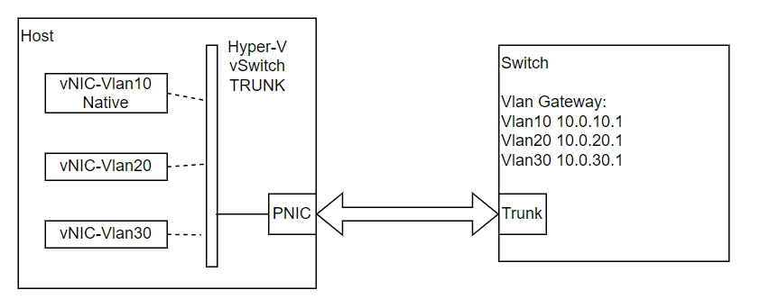

# Switch Validation - Host Hyper-V Setup

If Windows host server need to configure multiple vNICs (vlan interface), here are some reference commands to follow.

## Design



### Enable Hyper-V and Create vSwitch

```
Get-NetAdapter
New-VMSwitch -Name TRUNK -NetAdapterName <netadapter-name>
```

### Create vNIC based on vSwitch

```
Add-VMNetworkAdapter -ManagementOS -Name VLAN20 -SwitchName TRUNK
```

### Assign Access vlan id to the vNIC

```
Set-VMNetworkAdapterVlan -VMNetworkAdapterName Vlan20 -ManagementOS -Access -VlanId 20
```

### Assign IP to vNIC based on Vlan ID

```
Get-NetAdapter
Set-NetIPAddress -InterfaceIndex 12 -IPAddress 10.0.20.20 -PrefixLength 24
```

### Ping Vlan Gateway

```
ping 10.0.20.1
```

## Reference

- [Hyper-V Virtual Switch](https://learn.microsoft.com/en-us/windows-server/virtualization/hyper-v-virtual-switch/hyper-v-virtual-switch)
